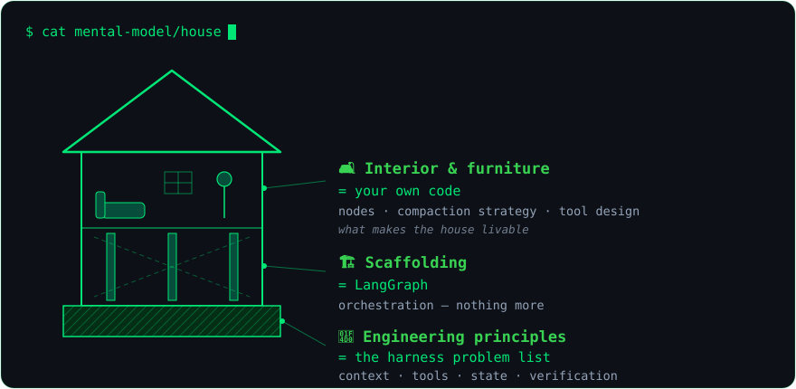
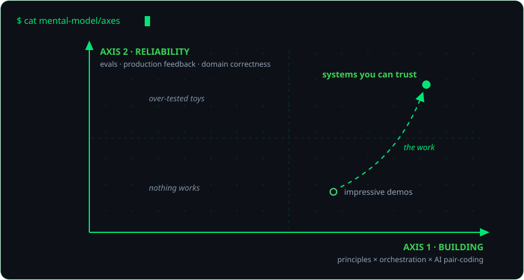

<div align="center">


<a href="https://git.io/typing-svg">
  
</a>

<p>
  <a href="README.zh-CN.md"></a>
  
</p>

<p>
  
  <a href="mailto:juzidekuwei@outlook.com"></a>
  <a href="https://github.com/juzikuwei/tech-radar-agent"></a>
</p>

</div>

## 🖥️ ~/whoami

I build AI-native applications that are **testable, observable, and grounded in evidence** — workflows that survive failure instead of only looking good in a demo.

**I don't hand-write code — every line here is written by AI (Claude Code & Codex).** I own the architecture, the design decisions, and the acceptance tests. Vibe coding, held to engineering standards.

- 🔭 **Now building** — [AI/Agent Tech Radar](https://github.com/juzikuwei/tech-radar-agent): hybrid retrieval (E5 + BM25 + RRF + cross-encoder), a bounded tool-calling ReAct agent, deterministic citation validation, and a read-only MCP server
- 🧪 **Exploring** — LangGraph, conversation-context compaction, agent evaluation loops, claim-level groundedness
- 🌏 **Working in** 中文 & English · UTC+8
- 📫 **Reach me** — juzidekuwei@outlook.com

> 中文简介：把 AI 产品想法做成可测试、可观测、可验证的工作流。代码全部由 AI（Claude Code、Codex、Cursor）编写——架构、技术决策与验收由我负责。


## 🚀 ~/projects

<table>
  <tr>
    <td width="50%" align="center" valign="top">
      <a href="https://github.com/juzikuwei/tech-radar-agent">
        
      </a>
      <p>
        
        
        
        
        
      </p>
      <p><sub>Vibe-coded with Claude Code & Codex — human-owned architecture and acceptance.</sub></p>
    </td>
    <td width="50%" align="center" valign="top">
      <a href="https://github.com/juzikuwei/focus-group-AI-Agent">
        
      </a>
      <p>
        
        
        
        
      </p>
      <p><sub>Vibe-coded with Claude Code & Codex — human-owned architecture and acceptance.</sub></p>
    </td>
  </tr>
</table>


## 🤖 ~/how-i-build

Every line of code here is AI-written — vibe coding with Claude Code, Codex & Cursor. The split:

| Mine | AI's |
| --- | --- |
| Architecture, scope and specs | Implementation — all of it |
| Code review and design questions | Refactors and boilerplate |
| Acceptance: tests, eval suites, traces | Test scaffolding |
| Decision records and trade-offs (ADRs) | Drafts I edit and approve |

<p align="center">
  
  
  
  
</p>


## 🏗️ ~/mental-model

Building an agent system is building a house:

<div align="center">
  
</div>

The scaffolding never decides how the rooms feel. Frameworks solve orchestration; the decisions that make an agent trustworthy have no scaffolding.

<div align="center">
  
</div>

```text
scope before framework
evidence before confidence
failure paths are product behavior
small experiments before large abstractions
ai writes, i verify
```

The code here is AI-written — the thinking is not.


## 📊 ~/stats

<div align="center">
  
  
</div>

<div align="center">
  
</div>

<div align="center">
  
</div>


## 🎨 ~/contribution-art

<div align="center">


<picture>
  <source media="(prefers-color-scheme: dark)" srcset="https://raw.githubusercontent.com/juzikuwei/juzikuwei/output/github-contribution-grid-snake-dark.svg" />
  <source media="(prefers-color-scheme: light)" srcset="https://raw.githubusercontent.com/juzikuwei/juzikuwei/output/github-contribution-grid-snake.svg" />
  
</picture>

</div>


## 🤝 ~/connect

I share the work as it becomes real: the architecture decisions, the awkward edge cases, the evaluation gaps, and the small improvements that make an AI workflow more trustworthy.

<p align="center">
  <a href="https://github.com/juzikuwei?tab=repositories"></a>
  <a href="mailto:juzidekuwei@outlook.com"></a>
</p>

<div align="center">

<sub>Building in public, one measurable workflow at a time.</sub>

</div>


