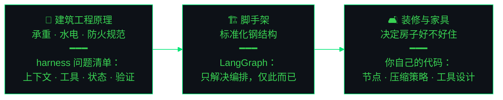

<div align="center">


<a href="https://git.io/typing-svg">
  
</a>

<p>
  
  <a href="README.md"></a>
</p>

<p>
  
  <a href="mailto:juzidekuwei@outlook.com"></a>
  <a href="https://github.com/juzikuwei/tech-radar-agent"></a>
</p>

</div>

## 🖥️ ~/whoami

我构建 AI-native 应用，要求它们**可测试、可观测、有证据支撑**——是能在失败里活下来的工作流，而不是只在 demo 里好看的东西。

**我不手写代码——这里的每一行代码都由 AI（Claude Code 和 Codex）编写。** 架构设计、技术决策和验收测试由我负责。Vibe coding，按工程标准交付。

- 🔭 **正在做** — [AI/Agent Tech Radar](https://github.com/juzikuwei/tech-radar-agent)：混合检索（E5 + BM25 + RRF + cross-encoder）、有界 tool-calling ReAct agent、确定性引用校验、只读 MCP server
- 🧪 **在探索** — LangGraph、会话上下文压缩、agent 评测闭环、claim-level groundedness
- 🌏 **工作语言** — 中文 & English · UTC+8
- 📫 **联系我** — juzidekuwei@outlook.com


## 🤖 ~/how-i-build

这里的每一行代码都由 AI 编写——与 Claude Code、Codex 和 Cursor 一起 vibe coding。分工如下：

| Mine | AI's |
| --- | --- |
| 架构、范围与 spec | 实现——全部代码 |
| 代码审查与设计质询 | 重构与样板代码 |
| 验收：测试、评测套件、Trace | 测试脚手架 |
| 决策记录与权衡取舍（ADR） | 文档草稿，由我编辑定稿 |

<p align="center">
  
  
  
  
</p>


## 🏗️ ~/mental-model

构建一个 agent 系统，就是在盖一栋房子：



脚手架从不决定房间住起来的感觉。框架解决的是编排；让 agent 值得信任的那些决策，没有现成脚手架。

两条轴线，一个系统：

- **构建** — 原理 × 编排 × AI 协作编码 → 决定它*能不能跑*
- **可靠** — 评测、生产反馈、业务正确性 → 决定它*能不能被信任*

只有轴一、没有轴二，交付的是 demo，不是系统。这里的代码由 AI 写——思考不是。


## 🚀 ~/projects

<table>
  <tr>
    <td width="50%" align="center" valign="top">
      <a href="https://github.com/juzikuwei/tech-radar-agent">
        
      </a>
      <p>
        
        
        
        
        
      </p>
      <p><sub>Vibe-coded with Claude Code & Codex — human-owned architecture and acceptance.</sub></p>
    </td>
    <td width="50%" align="center" valign="top">
      <a href="https://github.com/juzikuwei/focus-group-AI-Agent">
        
      </a>
      <p>
        
        
        
        
      </p>
      <p><sub>Vibe-coded with Claude Code & Codex — human-owned architecture and acceptance.</sub></p>
    </td>
  </tr>
</table>


## 🧭 ~/philosophy

```text
scope before framework
evidence before confidence
failure paths are product behavior
small experiments before large abstractions
ai writes, i verify
```


## 📊 ~/stats

<div align="center">
  
  
</div>

<div align="center">
  
</div>

<div align="center">
  
</div>


## 🎨 ~/contribution-art

<div align="center">


<picture>
  <source media="(prefers-color-scheme: dark)" srcset="https://raw.githubusercontent.com/juzikuwei/juzikuwei/output/github-contribution-grid-snake-dark.svg" />
  <source media="(prefers-color-scheme: light)" srcset="https://raw.githubusercontent.com/juzikuwei/juzikuwei/output/github-contribution-grid-snake.svg" />
  
</picture>

</div>


## 🤝 ~/connect

我边做边分享真实过程：架构决策、别扭的边界情况、评测里的缺口，以及每一个让 AI 工作流更可信的小改进。

<p align="center">
  <a href="https://github.com/juzikuwei?tab=repositories"></a>
  <a href="mailto:juzidekuwei@outlook.com"></a>
</p>

<div align="center">

<sub>公开地构建——一次一个可度量的工作流。</sub>

</div>


